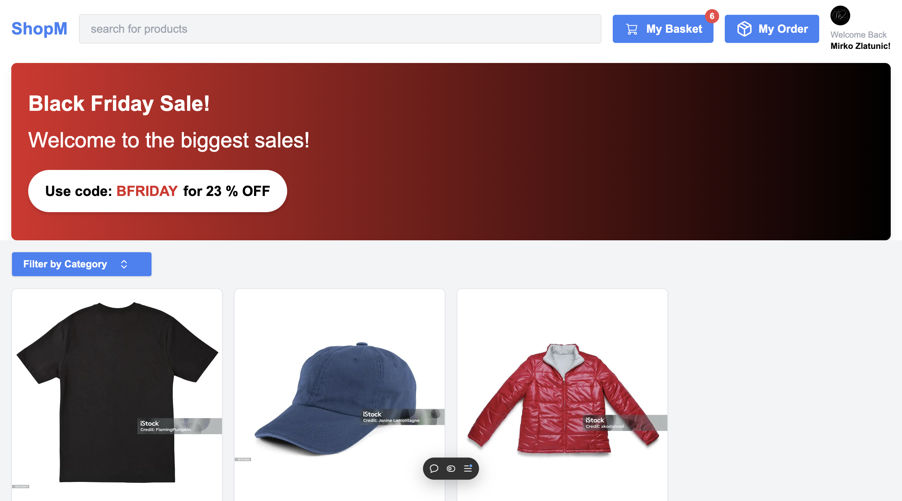
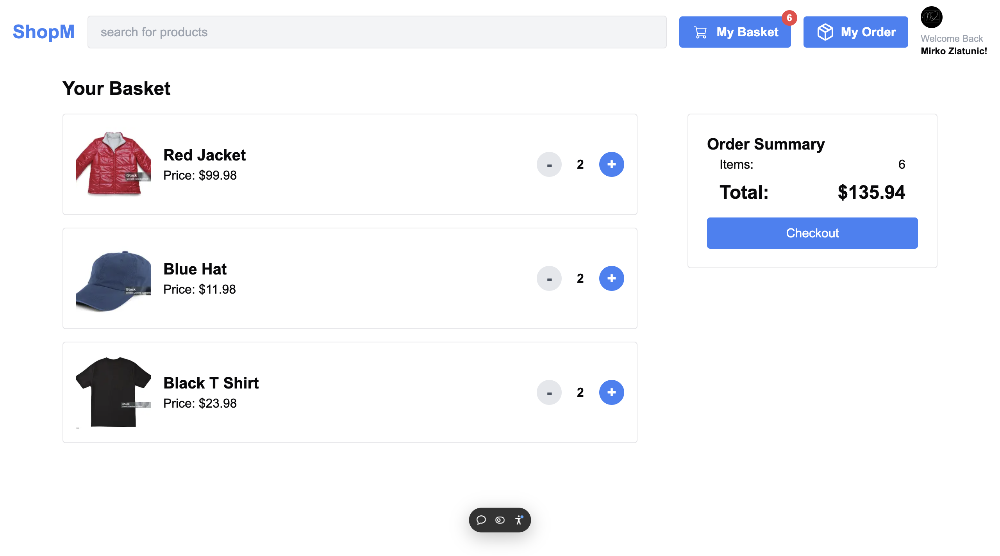
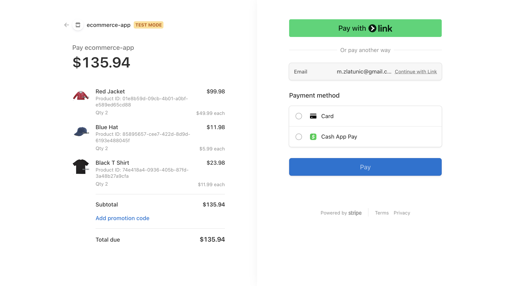

<h1>E-Commerce App</h1>

## 📋 <a name="table">Table of Contents</a>

1. 🤖 [Introduction](#introduction)
2. ⚙️ [Tech Stack](#tech-stack)
3. 🔋 [Link to Page](#link-page)
4. 🛠️ [Improvements Ideas](#improvements)

## <a name="introduction">🤖 Introduction</a>

This is an inspiring full-stack e-commerce application designed to empower you to shop for your favorite products. Built with Next.js 15 and utilizing Sanity for a robust backend, it harnesses the power of Stripe to manage payments and revenue operations while paving the way for innovative business models. With Clerk providing seamless sign-in and authentication, the user experience is transformed. The use of Tailwind CSS adds a captivating visual appeal, making your journey through the app truly enjoyable.

## <a name="tech-stack">⚙️ Tech Stack</a>

- HTML
- Tailwind CSS
- NextJS
- TypeScript
- Stripe
- Clerk
- Sanity

## <a name="link-page">🔋 Link to Page</a>

- Live Site URL: [Vercel Page](https://e-commerce-pi-amber-90.vercel.app)

## <a name="improvements">🛠️ Improvements Ideas</a>
